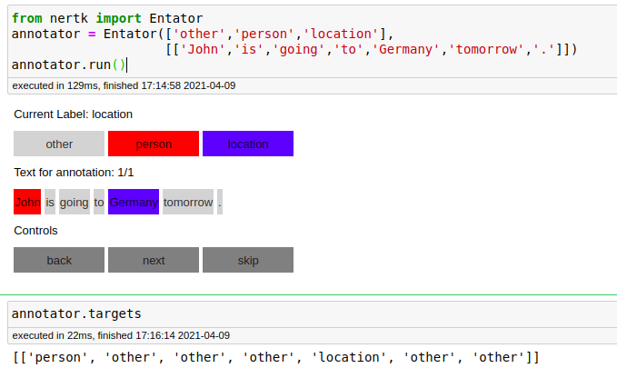

# nertk - Name Entity Recognition toolkit

Entator class - Annotate name entities in text  inline within your [Jupyter notebook](https://jupyter.org/) in Python. 


## 1 - Overview

In a data science or machine learning project, you may prepare and study text with name entities within a Jupyter notebook then need to annotate the data to augment the training or fix errors in your source data.

Since you are already working within a Jupyter notebook, the Entator works inline allowing you to interact with your data and annotate it quickly and easily, syncing straight back to your input data arrays or matrices.

Within Jupyter, you can easily home in on problem input data - perhaps only misclassified images - so you can step through and adjust bounding boxes just for those items. 

The Entator widget is designed with a flexible API making it quick and easy to get started exploring your dataset, guessing how to work with your data without explicit configuration where possible.

The project is currently in ALPHA development phase, and I appreciate all feedback on any problems including details on how the current code works or fails to work for the structure of your particular projects.


## 2 - Examples

You can easily combine Entator's interactive components to suit your project. Here are some examples.

### Annotate new samples


Then set up Entator to display buttons for each label and each word in the text, click on button to change the label.

```python
from nertk import Entator
annotator = Entator(labels=['other','person','location'],
                    inputs=[['John','is','going','to','Germany','tomorrow','.']])
annotator.run()

#get annotation
annotator.targets
```



### Correct annotated  samples

```python
from nertk import Entator
annotator = Entator(labels=['other','person','location'],
                    inputs=[['John','is','going','to','Germany','tomorrow','.']],
                    targets=[['person', 'other', 'other', 'other', 'location', 'other', 'other']])
annotator.run()

#get annotation
annotator.targets
```

## 3 - Installation

### Install from PyPi (recommended)

```
pip install nertk
```

## 4 - Contact for Feedback

Please get in touch with any feedback or questions: [Linkedin](https://www.linkedin.com/in/ionmosnoi/). It will be especially useful to understand the structure of your project and what is needed for your data annotation - e.g. extra entity types. There are many ideas on the roadmap, and your input is vital for prioritising these.

## 5 - License

This code is released under an MIT license.
